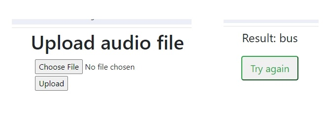

# Sound recognition
{width=50%} 

## Table of contents
* [General info](#general-info)
* [Deployment](#deployment)
* [Technologies](#technologies)
* [Setup](#setup)

## General info

The goal of this project is to develop machine learning (ML) model to classify sounds. For the particular purpose of this project, we have chosen sounds produced by three types of vehicles in the city streets, namely buses, cars and trams. 
For this reason, the dataset of such sounds was collected with the help of the participants of “COMP.SGN.120-2023-2024-1 Introduction to Audio Processing” course at Tampere University and uploaded to the site 
[freesound.org](https://freesound.org/). 
After that, several features were extracted, namely Mel-frequency cepstral coefficients (MFCCs). With these spectral features we tried several types of machine learning tools: k-nearest neighbor classification, 
support vector machine, decision tree with feature extracted from MFCC. For audio signal procession and machine learning classification we use Python libraries librosa and sklearn, respectively. All types of ML algorithm show decent accuracy of about 90% for sound classification. Therefore, it was decided to write a simple Flask app that classifies uploaded audio files into three classes: car, bus, tram.  

The logic of sound recognition is developed using the trained kNN model using the data set of 380/class recordings. The app is deployed on AWS lightsail container service using Docker container. 
You are welcome to test it at
https://sound-recognition-car-bus-tram.appaqc9h6e2d4.eu-central-1.cs.amazonlightsail.com/. 
Be ready to upload approximately 5-second audio in wav format. 

## Technologies
Project is created with:
* Python 3.11.0 
* Flask==3.0.0
* Jinja2==3.1.2
* gunicorn==21.2.0
* librosa==0.10.1
* scikit-learn==1.3.2

It was tested in a browser 
* Microsoft Edge Version 114.0.1823.43 (Official build) (64-bit)

## Setup
Clone this repo to your desktop or download zip and unpack

## Usage
After you clone this repo to your desktop,   run pip install -r requirements.txt
to install all the dependencies.

Once the dependencies are installed, you can run app.py file to start the application. You will then be able to access it at localhost:5000
